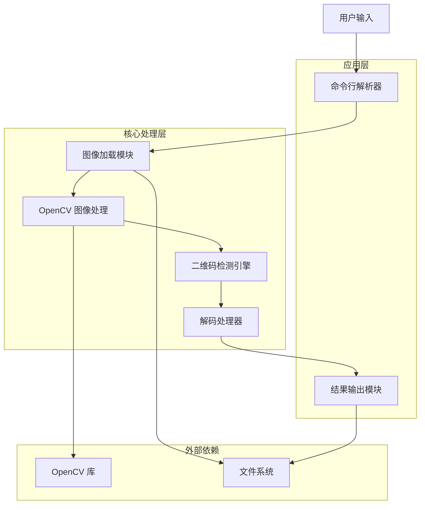
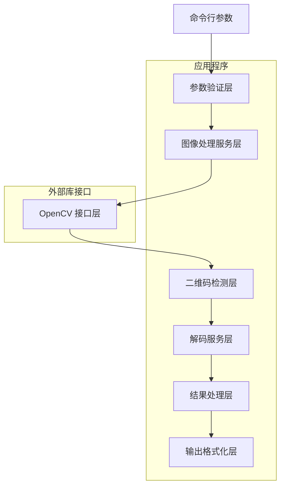
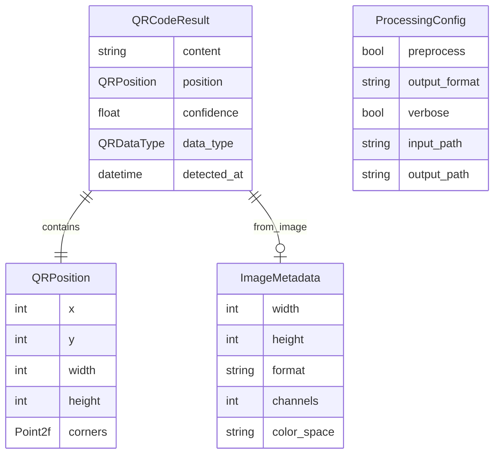

# 基于 OpenCV-Rust 的二维码解码器技术架构文档

## 1. Architecture design



## 2. Technology Description

- Frontend: 无（命令行应用）
- Backend: Rust + opencv-rust@0.95.1 + clap@4.0 + serde@1.0 + serde_json@1.0

## 3. Route definitions

本项目为命令行应用程序，不涉及 Web 路由，主要的程序入口点：

| Entry Point | Purpose |
|-------------|----------|
| main() | 程序主入口，处理命令行参数和整体流程控制 |
| decode_qr() | 二维码解码核心函数 |
| process_image() | 图像处理和预处理函数 |
| output_result() | 结果输出和格式化函数 |

## 4. API definitions

### 4.1 Core API

**图像处理相关**

```rust
// 图像加载
pub fn load_image(path: &str) -> Result<Mat, opencv::Error>

// 图像预处理
pub fn preprocess_image(image: &Mat) -> Result<Mat, opencv::Error>

// 二维码检测
pub fn detect_qr_codes(image: &Mat) -> Result<Vec<QRCode>, opencv::Error>
```

**解码相关**

```rust
// 二维码解码
pub fn decode_qr_code(qr_region: &Mat) -> Result<String, DecodeError>

// 结果结构体
#[derive(Serialize, Deserialize, Debug)]
pub struct QRCodeResult {
    pub content: String,
    pub position: QRPosition,
    pub confidence: f32,
    pub data_type: QRDataType,
}

#[derive(Serialize, Deserialize, Debug)]
pub struct QRPosition {
    pub x: i32,
    pub y: i32,
    pub width: i32,
    pub height: i32,
    pub corners: Vec<Point2f>,
}

#[derive(Serialize, Deserialize, Debug)]
pub enum QRDataType {
    Text,
    Url,
    Email,
    Phone,
    WiFi,
    VCard,
    Unknown,
}
```

**命令行接口**

```rust
#[derive(Parser, Debug)]
#[command(author, version, about, long_about = None)]
pub struct Args {
    /// 输入图像文件路径
    #[arg(short, long)]
    pub input: String,
    
    /// 输出格式 (json, text, csv)
    #[arg(short, long, default_value = "text")]
    pub output_format: String,
    
    /// 输出文件路径（可选）
    #[arg(short = 'o', long)]
    pub output_file: Option<String>,
    
    /// 详细输出模式
    #[arg(short, long)]
    pub verbose: bool,
    
    /// 图像预处理选项
    #[arg(long)]
    pub preprocess: bool,
}
```

## 5. Server architecture diagram



## 6. Data model

### 6.1 Data model definition



### 6.2 Data Definition Language

本项目不使用传统数据库，主要使用内存中的数据结构和文件系统存储。

**核心数据结构定义：**

```rust
// Cargo.toml 依赖配置
[dependencies]
opencv = "0.95.1"
clap = { version = "4.0", features = ["derive"] }
serde = { version = "1.0", features = ["derive"] }
serde_json = "1.0"
anyhow = "1.0"
log = "0.4"
env_logger = "0.10"

// 错误处理类型
#[derive(Debug, thiserror::Error)]
pub enum QRDecodeError {
    #[error("OpenCV error: {0}")]
    OpenCVError(#[from] opencv::Error),
    
    #[error("IO error: {0}")]
    IoError(#[from] std::io::Error),
    
    #[error("No QR code found in image")]
    NoQRCodeFound,
    
    #[error("Failed to decode QR code: {0}")]
    DecodeError(String),
    
    #[error("Unsupported image format: {0}")]
    UnsupportedFormat(String),
}

// 配置结构体
#[derive(Debug, Clone)]
pub struct ProcessingConfig {
    pub input_path: PathBuf,
    pub output_path: Option<PathBuf>,
    pub output_format: OutputFormat,
    pub preprocess: bool,
    pub verbose: bool,
    pub detection_params: DetectionParams,
}

#[derive(Debug, Clone)]
pub struct DetectionParams {
    pub min_size: i32,
    pub max_size: i32,
    pub threshold: f64,
    pub use_adaptive_threshold: bool,
}
```