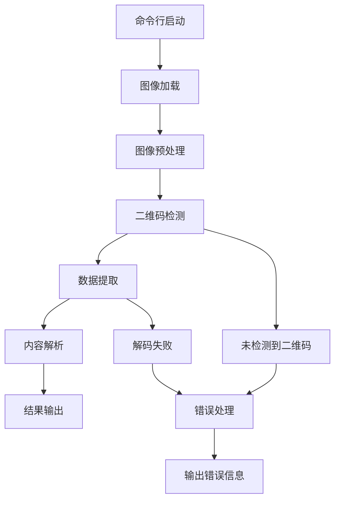

# 基于 OpenCV-Rust 的二维码解码器产品需求文档

## 1. Product Overview

本项目是一个基于 Rust 语言和 OpenCV 库开发的二维码解码器，旨在提供高性能、安全可靠的二维码识别和解码功能。
- 解决图像中二维码自动识别和内容提取的问题，面向需要批量处理二维码图像的开发者和企业用户。
- 利用 Rust 的内存安全特性和 OpenCV 的强大图像处理能力，提供稳定高效的二维码处理解决方案。

## 2. Core Features

### 2.1 Feature Module

我们的二维码解码器包含以下核心页面：
1. **命令行界面**：参数配置、文件输入、结果输出
2. **图像处理模块**：图像加载、预处理、二维码检测
3. **解码模块**：二维码定位、数据提取、内容解析
4. **结果输出模块**：解码结果格式化、文件保存、错误处理

### 2.2 Page Details

| Page Name | Module Name | Feature description |
|-----------|-------------|---------------------|
| 命令行界面 | 参数解析 | 接收输入文件路径、输出格式选项、调试模式等命令行参数 |
| 命令行界面 | 帮助信息 | 显示使用说明、参数列表、示例命令 |
| 图像处理模块 | 图像加载 | 支持 JPEG、PNG、BMP 等常见图像格式的读取和验证 |
| 图像处理模块 | 图像预处理 | 灰度转换、噪声降低、对比度增强、尺寸调整 |
| 图像处理模块 | 二维码检测 | 使用 OpenCV 的特征检测算法定位图像中的二维码区域 |
| 解码模块 | 二维码定位 | 精确定位二维码的四个角点和方向 |
| 解码模块 | 数据提取 | 从二维码图案中提取原始二进制数据 |
| 解码模块 | 内容解析 | 解析二维码数据格式，支持文本、URL、联系人等类型 |
| 结果输出模块 | 结果格式化 | 将解码结果格式化为 JSON、纯文本或结构化数据 |
| 结果输出模块 | 文件保存 | 支持将结果保存到指定文件或输出到标准输出 |
| 结果输出模块 | 错误处理 | 处理无法识别、损坏或格式错误的二维码，提供详细错误信息 |

## 3. Core Process

**主要用户操作流程：**

1. 用户通过命令行启动程序，指定输入图像文件路径
2. 程序加载并验证图像文件格式
3. 对图像进行预处理（灰度化、降噪等）
4. 使用 OpenCV 算法检测图像中的二维码区域
5. 对检测到的二维码进行精确定位和数据提取
6. 解析二维码数据并识别内容类型
7. 格式化输出结果到控制台或保存到文件
8. 处理错误情况并提供用户友好的错误信息

## 4. User Interface Design

### 4.1 Design Style

- **界面类型**：命令行界面（CLI）
- **输出格式**：结构化文本输出，支持彩色终端显示
- **字体**：等宽字体，确保对齐和可读性
- **颜色方案**：
  - 成功信息：绿色 (#00FF00)
  - 错误信息：红色 (#FF0000)
  - 警告信息：黄色 (#FFFF00)
  - 普通信息：白色/默认终端颜色
- **布局风格**：简洁的文本输出，清晰的信息层次

### 4.2 Page Design Overview

| Page Name | Module Name | UI Elements |
|-----------|-------------|-------------|
| 命令行界面 | 参数解析 | 命令行参数提示，使用说明文本，错误提示信息 |
| 命令行界面 | 帮助信息 | 格式化的帮助文档，参数说明表格，使用示例 |
| 结果输出模块 | 结果显示 | 结构化的解码结果，JSON 格式输出，进度指示器 |
| 结果输出模块 | 错误处理 | 彩色错误信息，详细错误描述，建议解决方案 |

### 4.3 Responsiveness

本项目为命令行应用程序，主要考虑终端兼容性：
- 支持各种终端尺寸，自适应输出宽度
- 兼容 Windows、macOS、Linux 终端环境
- 支持管道操作和批处理脚本集成